# RecoverAI

**AI-powered payment recovery platform** — a full-stack system that detects failed and at-risk payments, figures out *why* they failed, decides the best way to win them back, and automatically runs recovery campaigns across channels — all while giving merchants clear, explainable AI reasoning behind every decision instead of a black box.

At its core, RecoverAI watches a merchant's payment and subscription activity in real time, classifies failures (card declined, insufficient funds, expired card, gateway timeout, etc.), predicts which customers are likely to churn or recover on their own, and orchestrates AI agents that decide, execute, and monitor recovery actions — retries, discount offers, reminder emails, alternate payment links — end to end. Every decision an agent makes is logged and explainable, so merchants can see exactly why a customer was offered a 10% discount instead of a simple retry, or why a case was escalated instead of automated.

### Tech Stack

| Layer | Technology |
|---|---|
| **Frontend** | React, TypeScript, Vite, Tailwind CSS, Framer Motion, Recharts, Axios |
| **Backend** | Node.js, Express, TypeScript |
| **Database & ORM** | PostgreSQL via Prisma |
| **Auth & Infra** | Supabase |
| **AI Orchestration** | OpenRouter (LLM routing layer powering the recovery agents — prediction, decisioning, explainability, revenue analysis, and more) |

Built as a monorepo with two apps, `frontend/` and `backend/`. Every endpoint, field name, and enum value used in the frontend was read directly from the backend source — nothing was invented.

---

## 🔑 Demo Login

> ### **Email:** `vaibhavyadav7july@gmail.com`
> ### **Password:** `123456`

**Use these credentials to log in to the app and explore the full dashboard, recovery pipeline, campaigns, and AI modules.**

---

## Overview

RecoverAI helps merchants recover revenue lost to failed payments and churned subscriptions. The backend runs a pipeline of AI **agents**, powered through **OpenRouter**, on top of live payment, order, and customer data:

- **Recovery Prediction** — scores each failed payment on likelihood of self-recovery vs needing intervention
- **Recovery Failure Analysis** — classifies *why* a payment failed (card declined, insufficient funds, expired card, gateway/network error, etc.)
- **Recovery Decision** — chooses the best next action for a case (retry, discount campaign, reminder, escalation)
- **Recovery Action / Executor** — carries out the chosen action (creating campaigns, triggering retries, sending communications)
- **Recovery Monitoring** — tracks case and pipeline health in real time
- **Recovery Outcome** — records whether the action actually recovered the revenue
- **AI Explainability** — turns each agent decision into a human-readable explanation for the merchant
- **Revenue Analyst** — aggregates recovery performance into revenue insights and trends
- **Customer Communication** — generates and manages the outbound messages sent to customers during recovery

These agents are exposed through a REST API, and orchestrated together into an end-to-end recovery pipeline — from a payment failing, to diagnosing why, to deciding and executing a recovery action, to monitoring the outcome. The frontend is a merchant-facing dashboard that visualizes recovery cases, campaigns, payment failures, subscriptions, and every AI decision along the way, in one place.

## Design System

Razorpay-inspired light theme:

- **Primary blue** `#3395FF` (Dodger Blue) — buttons, links, active states, chart highlights
- **Deep navy** `#0C2651` — sidebar background only; main content stays light/white
- All colors are CSS custom properties defined in `src/index.css` (`:root`) and mapped into Tailwind via `tailwind.config.js` (`bg-*`, `text-*`, `brand-*`, `navy-*` classes) — retheme the whole app by editing the variables in one place, never hunt for hardcoded hex values.

## Motion

Shared tokens live in `src/lib/motion.ts` — easing `[0.16, 1, 0.3, 1]`, durations 150–320ms. Framer Motion powers:

- Fade/slide page transitions on route change (`DashboardLayout`, `AuthLayout`)
- A sliding `layoutId` highlight behind the active sidebar item
- Stat cards and table rows staggering in on load
- Modals scaling + fading in/out (`Modal.tsx`, used by `ConfirmDialog`)
- Toasts sliding in from the right
- Buttons scaling on hover/press

## Charts

`src/components/charts/` — `DonutChart`, `BarChartCard`, `RadialGauge`, all Recharts-based, minimally styled (light grid lines, no borders, custom tooltip matching the UI), and empty-state aware. Used on the Dashboard, Revenue Analyst, Recovery Monitoring, Recovery Cases list (status distribution), and Payment Failures list (category breakdown).

## AI Modules

The AI Hub surfaces the backend's OpenRouter-powered recovery agents in the UI:

- **Revenue Analyst** — aggregate recovery/revenue insights
- **Recovery Monitoring** — live pipeline health and case tracking
- **Recovery Pipeline (Batch)** — batch-run recovery predictions/decisions
- **Explainability** — per-decision reasoning for why a recovery action was taken (see known gap #1 below)

AI Predictions and AI Decisions are not separate CRUD resources — they render inline inside `RecoveryCaseDetailPage`, nested off the case detail response.

---

## Database Schema (ER Diagram)

The database runs on **PostgreSQL via Supabase**, modeled with **Prisma**. It's built around one core idea: every failed payment becomes a `recovery_case`, and every AI agent action, prediction, and decision made about that case is fully logged and traceable back to it.

```mermaid
erDiagram
    MERCHANTS ||--o{ PROFILES : has
    MERCHANTS ||--o| MERCHANT_SETTINGS : configures
    MERCHANTS ||--o{ CUSTOMERS : owns
    MERCHANTS ||--o{ CUSTOMER_SEGMENTS : defines
    MERCHANTS ||--o{ PRODUCTS : sells
    MERCHANTS ||--o{ ORDERS : has
    MERCHANTS ||--o{ CHECKOUT_SESSIONS : has
    MERCHANTS ||--o{ TRANSACTIONS : has
    MERCHANTS ||--o{ PAYMENTS : has
    MERCHANTS ||--o{ PAYMENT_FAILURES : has
    MERCHANTS ||--o{ SUBSCRIPTIONS : has
    MERCHANTS ||--o{ RECOVERY_STRATEGIES : owns
    MERCHANTS ||--o{ RECOVERY_CASES : has
    MERCHANTS ||--o{ RECOVERY_ACTIONS : has
    MERCHANTS ||--o{ AI_PREDICTIONS : has
    MERCHANTS ||--o{ AI_DECISIONS : has
    MERCHANTS ||--o{ CAMPAIGNS : runs
    MERCHANTS ||--o{ NOTIFICATIONS : sends
    MERCHANTS ||--o{ EVENTS : emits
    MERCHANTS ||--o{ DAILY_REVENUE_METRICS : tracks
    MERCHANTS ||--o{ EXPERIMENTS : runs
    MERCHANTS ||--o{ AUDIT_LOGS : logs

    CUSTOMERS ||--o{ CUSTOMER_PAYMENT_METHODS : has
    CUSTOMERS ||--o{ ORDERS : places
    CUSTOMERS ||--o{ CHECKOUT_SESSIONS : starts
    CUSTOMERS ||--o{ TRANSACTIONS : makes
    CUSTOMERS ||--o{ PAYMENTS : makes
    CUSTOMERS ||--o{ SUBSCRIPTIONS : holds
    CUSTOMERS ||--o{ RECOVERY_CASES : involved_in
    CUSTOMERS ||--o{ NOTIFICATIONS : receives
    CUSTOMERS ||--o{ EXPERIMENT_ASSIGNMENTS : assigned_to

    PRODUCTS ||--o{ SUBSCRIPTIONS : subscribed_as

    ORDERS ||--o{ CHECKOUT_SESSIONS : linked_to
    ORDERS ||--o{ TRANSACTIONS : linked_to

    CHECKOUT_SESSIONS ||--o{ RECOVERY_CASES : source_of

    TRANSACTIONS ||--o{ PAYMENTS : linked_to

    CUSTOMER_PAYMENT_METHODS ||--o{ PAYMENTS : used_for
    CUSTOMER_PAYMENT_METHODS ||--o{ PAYMENT_ATTEMPTS : used_for

    PAYMENTS ||--o{ PAYMENT_ATTEMPTS : has
    PAYMENTS ||--o{ PAYMENT_FAILURES : has
    PAYMENTS ||--o{ SUBSCRIPTION_PAYMENTS : settles
    PAYMENTS ||--o{ RECOVERY_CASES : source_of

    PAYMENT_ATTEMPTS ||--o{ PAYMENT_FAILURES : caused

    SUBSCRIPTIONS ||--o{ SUBSCRIPTION_PAYMENTS : bills

    SUBSCRIPTION_PAYMENTS ||--o{ RECOVERY_CASES : source_of

    RECOVERY_STRATEGIES ||--o{ RECOVERY_ACTIONS : guides
    RECOVERY_STRATEGIES ||--o{ CAMPAIGNS : powers
    RECOVERY_STRATEGIES ||--o{ EXPERIMENT_VARIANTS : tested_as

    RECOVERY_CASES ||--o{ RECOVERY_ACTIONS : triggers
    RECOVERY_CASES ||--o{ AI_PREDICTIONS : scored_by
    RECOVERY_CASES ||--o{ AI_DECISIONS : decided_by
    RECOVERY_CASES ||--o{ CAMPAIGN_ACTIONS : targeted_by
    RECOVERY_CASES ||--o{ NOTIFICATIONS : generates
    RECOVERY_CASES ||--o{ EXPERIMENT_ASSIGNMENTS : part_of

    AI_PREDICTIONS ||--o{ AI_DECISIONS : informs

    AI_DECISIONS ||--o{ AI_EXPLANATIONS : explained_by

    CAMPAIGNS ||--o{ CAMPAIGN_ACTIONS : contains

    EXPERIMENTS ||--o{ EXPERIMENT_VARIANTS : has
    EXPERIMENTS ||--o{ EXPERIMENT_ASSIGNMENTS : has
    EXPERIMENTS ||--o{ EXPERIMENT_RESULTS : has
    EXPERIMENT_VARIANTS ||--o{ EXPERIMENT_ASSIGNMENTS : assigned_as
    EXPERIMENT_VARIANTS ||--o{ EXPERIMENT_RESULTS : scored_as

    MERCHANTS {
        uuid id PK
        string business_name
        string legal_name
        string email UK
        string country
        string currency
        string timezone
        enum status
        timestamp created_at
        timestamp updated_at
    }

    PROFILES {
        uuid id PK, FK
        uuid merchant_id FK
        string full_name
        string email
        enum role
        enum status
        timestamp created_at
        timestamp updated_at
    }

    MERCHANT_SETTINGS {
        uuid id PK
        uuid merchant_id FK, UK
        boolean recovery_enabled
        boolean ai_enabled
        int max_retry_attempts
        int default_retry_delay_minutes
        boolean notification_enabled
        jsonb settings
        timestamp created_at
        timestamp updated_at
    }

    CUSTOMERS {
        uuid id PK
        uuid merchant_id FK
        string external_customer_id
        string name
        string email
        string phone
        string country
        decimal lifetime_value
        int total_transactions
        int successful_payments
        int failed_payments
        int recovered_payments
        decimal total_recovered_amount
        enum status
        jsonb metadata
        timestamp created_at
        timestamp updated_at
    }

    CUSTOMER_PAYMENT_METHODS {
        uuid id PK
        uuid customer_id FK
        string type
        string provider
        string last_four
        int expiry_month
        int expiry_year
        boolean is_default
        enum status
        jsonb metadata
        timestamp created_at
        timestamp updated_at
    }

    CUSTOMER_SEGMENTS {
        uuid id PK
        uuid merchant_id FK
        string name
        text description
        jsonb criteria
        timestamp created_at
        timestamp updated_at
    }

    PRODUCTS {
        uuid id PK
        uuid merchant_id FK
        string name
        text description
        decimal price
        string currency
        enum status
        jsonb metadata
        timestamp created_at
        timestamp updated_at
    }

    ORDERS {
        uuid id PK
        uuid merchant_id FK
        uuid customer_id FK
        string order_number
        decimal total_amount
        string currency
        string status
        jsonb metadata
        timestamp created_at
        timestamp updated_at
    }

    CHECKOUT_SESSIONS {
        uuid id PK
        uuid merchant_id FK
        uuid customer_id FK
        uuid order_id FK
        decimal amount
        string currency
        enum status
        timestamp started_at
        timestamp last_activity_at
        timestamp completed_at
        timestamp abandoned_at
        timestamp expires_at
        jsonb metadata
        timestamp created_at
        timestamp updated_at
    }

    TRANSACTIONS {
        uuid id PK
        uuid merchant_id FK
        uuid customer_id FK
        uuid order_id FK
        string external_transaction_id
        decimal amount
        string currency
        enum type
        enum status
        jsonb metadata
        timestamp created_at
        timestamp updated_at
    }

    PAYMENTS {
        uuid id PK
        uuid merchant_id FK
        uuid customer_id FK
        uuid transaction_id FK
        uuid payment_method_id FK
        decimal amount
        string currency
        string provider
        string provider_payment_id
        enum status
        string failure_code
        text failure_message
        jsonb metadata
        timestamp created_at
        timestamp updated_at
    }

    PAYMENT_ATTEMPTS {
        uuid id PK
        uuid payment_id FK
        int attempt_number
        decimal amount
        uuid payment_method_id FK
        string provider
        enum status
        string failure_code
        enum failure_category
        jsonb provider_response
        timestamp started_at
        timestamp completed_at
        timestamp created_at
    }

    PAYMENT_FAILURES {
        uuid id PK
        uuid payment_id FK
        uuid payment_attempt_id FK
        uuid merchant_id FK
        string failure_code
        enum failure_category
        text failure_reason
        boolean retryable
        enum severity
        string provider
        jsonb metadata
        timestamp created_at
    }

    SUBSCRIPTIONS {
        uuid id PK
        uuid merchant_id FK
        uuid customer_id FK
        uuid product_id FK
        string external_subscription_id
        string plan_name
        decimal amount
        string currency
        enum billing_interval
        enum status
        timestamp start_date
        timestamp current_period_start
        timestamp current_period_end
        timestamp cancelled_at
        jsonb metadata
        timestamp created_at
        timestamp updated_at
    }

    SUBSCRIPTION_PAYMENTS {
        uuid id PK
        uuid subscription_id FK
        uuid payment_id FK
        string billing_period
        decimal amount
        string currency
        enum status
        timestamp due_date
        timestamp paid_at
        timestamp created_at
        timestamp updated_at
    }

    RECOVERY_STRATEGIES {
        uuid id PK
        uuid merchant_id FK
        string name
        enum type
        text description
        jsonb configuration
        boolean is_active
        timestamp created_at
        timestamp updated_at
    }

    RECOVERY_CASES {
        uuid id PK
        uuid merchant_id FK
        uuid customer_id FK
        uuid payment_id FK
        uuid subscription_payment_id FK
        uuid checkout_session_id FK
        decimal original_amount
        decimal recoverable_amount
        decimal recovered_amount
        decimal recovery_score
        decimal recovery_probability
        decimal expected_recovery_amount
        enum status
        enum priority
        timestamp created_at
        timestamp updated_at
        timestamp closed_at
    }

    RECOVERY_ACTIONS {
        uuid id PK
        uuid merchant_id FK
        uuid recovery_case_id FK
        uuid strategy_id FK
        enum action_type
        enum status
        int attempt_number
        timestamp scheduled_at
        timestamp started_at
        timestamp completed_at
        text result
        text error
        jsonb metadata
        timestamp created_at
        timestamp updated_at
    }

    AI_PREDICTIONS {
        uuid id PK
        uuid merchant_id FK
        uuid recovery_case_id FK
        string model_provider
        string model_name
        string model_version
        decimal recovery_score
        decimal recovery_probability
        decimal expected_recovery_amount
        enum confidence
        jsonb prediction_reasons
        jsonb input_snapshot
        timestamp created_at
    }

    AI_DECISIONS {
        uuid id PK
        uuid merchant_id FK
        uuid recovery_case_id FK
        uuid prediction_id FK
        string agent_name
        string decision_type
        enum recommended_action
        text reasoning_summary
        enum confidence
        jsonb structured_decision
        timestamp created_at
    }

    AI_EXPLANATIONS {
        uuid id PK
        uuid ai_decision_id FK
        text summary
        jsonb positive_factors
        jsonb negative_factors
        jsonb reason_codes
        timestamp created_at
    }

    CAMPAIGNS {
        uuid id PK
        uuid merchant_id FK
        string name
        text description
        enum status
        jsonb target_criteria
        uuid strategy_id FK
        timestamp start_date
        timestamp end_date
        timestamp created_at
        timestamp updated_at
    }

    CAMPAIGN_ACTIONS {
        uuid id PK
        uuid campaign_id FK
        uuid recovery_case_id FK
        string action
        enum status
        text result
        timestamp created_at
    }

    NOTIFICATIONS {
        uuid id PK
        uuid merchant_id FK
        uuid customer_id FK
        uuid recovery_case_id FK
        enum channel
        string template
        string recipient
        text subject
        text content
        enum status
        timestamp sent_at
        timestamp delivered_at
        timestamp failed_at
        string provider_id
        jsonb metadata
        timestamp created_at
    }

    EVENTS {
        uuid id PK
        uuid merchant_id FK
        string event_type
        string aggregate_type
        uuid aggregate_id
        jsonb payload
        enum status
        boolean processed
        timestamp processed_at
        text error
        timestamp created_at
    }

    DAILY_REVENUE_METRICS {
        uuid id PK
        uuid merchant_id FK
        date metric_date
        decimal total_revenue
        decimal failed_revenue
        decimal recoverable_revenue
        decimal recovered_revenue
        decimal revenue_at_risk
        int total_payments
        int failed_payments
        int recovered_payments
        decimal recovery_rate
        decimal payment_recovery_rate
        bigint average_recovery_time_seconds
        timestamp created_at
        timestamp updated_at
    }

    EXPERIMENTS {
        uuid id PK
        uuid merchant_id FK
        string name
        text description
        enum status
        timestamp start_date
        timestamp end_date
        timestamp created_at
        timestamp updated_at
    }

    EXPERIMENT_VARIANTS {
        uuid id PK
        uuid experiment_id FK
        string name
        uuid strategy_id FK
        decimal traffic_percentage
        timestamp created_at
    }

    EXPERIMENT_ASSIGNMENTS {
        uuid id PK
        uuid experiment_id FK
        uuid variant_id FK
        uuid customer_id FK
        uuid recovery_case_id FK
        timestamp created_at
    }

    EXPERIMENT_RESULTS {
        uuid id PK
        uuid experiment_id FK
        uuid variant_id FK
        int total_cases
        int successful_recoveries
        decimal recoverable_amount
        decimal recovered_amount
        decimal recovery_rate
        timestamp created_at
        timestamp updated_at
    }

    AUDIT_LOGS {
        uuid id PK
        uuid merchant_id FK
        uuid user_id FK
        string action
        string entity_type
        uuid entity_id
        jsonb old_values
        jsonb new_values
        inet ip_address
        text user_agent
        timestamp created_at
    }
```



**Key flow through the schema:** a `payment` fails → a `payment_attempt` and `payment_failure` record why → this opens a `recovery_case` → an `ai_prediction` scores its recovery likelihood → an `ai_decision` (backed by an `ai_explanation`) picks a `recovery_action` (often driven by a `recovery_strategy` and grouped into a `campaign`) → the action triggers a `notification` to the customer → the outcome updates the case, and rolls up into `daily_revenue_metrics` for reporting. `experiments` and `experiment_variants` let merchants A/B test different recovery strategies against each other, with `experiment_results` tracking which one wins.

---

## Setup

### 1. Backend

```bash
cd backend
npm install
cp .env.example .env    # configure DATABASE_URL, SUPABASE keys, AI provider keys, etc.
npx prisma generate
npm run dev
```

### 2. Frontend

```bash
cd frontend
npm install
cp .env.example .env    # set VITE_API_BASE_URL to your backend's /api URL
npm run dev
```

### 3. Log in

Open the app and sign in with the demo credentials above, or register a new merchant account.

## Build

```bash
# frontend
cd frontend
npm run build

# backend
cd backend
npm run build
```

---

## Known Gaps (carried over from the backend)

1. **`/api/explainability` was not mounted** in the backend's `routes/index.ts` in the original delivery — **fix already applied** in `backend/` (this delivery). The AI Explainability page shows a clear inline message instead of pretending it works if the route is ever missing.
2. **No endpoint to read/update merchant business info** after registration. `AuthContext` caches `merchant`/`profile` from the registration response in `localStorage` so it survives a refresh. The Settings page's "Business information" card is read-only for this reason.
3. **Notifications have no read/unread flag** — the Notifications page shows delivery `status` instead, since that's all the backend models.
4. **AI Predictions / AI Decisions** are not separate CRUD resources — they render inside `RecoveryCaseDetailPage`, nested off the case detail response.

---

## Folder Structure

```
RecoverAI/
│
├── backend/
│   ├── .agents/
│   │   └── skills/
│   ├── .claude/
│   ├── .windsurf/
│   ├── generated/
│   ├── prisma/
│   ├── node_modules/
│   ├── .env
│   ├── .gitignore
│   ├── package.json
│   ├── package-lock.json
│   ├── prisma.config.ts
│   ├── skills-lock.json
│   ├── test-db.ts
│   │
│   └── src/
│       ├── agents/
│       │   └── recovery/
│       │       ├── aiExplainability.agent.ts
│       │       ├── customerCommunication.agent.ts
│       │       ├── recoveryAction.agent.ts
│       │       ├── recoveryDecision.agent.ts
│       │       ├── recoveryExecutor.agent.ts
│       │       ├── recoveryFailureAnalysis.agent.ts
│       │       ├── recoveryMonitoring.agent.ts
│       │       ├── recoveryOutcome.agent.ts
│       │       ├── recoveryPrediction.agent.ts
│       │       └── revenueAnalyst.agent.ts
│       │
│       ├── config/
│       │   ├── ai.ts
│       │   ├── database.ts
│       │   └── supabase.ts
│       │
│       ├── controllers/
│       │   ├── audit-log.controller.ts
│       │   ├── auth.controller.ts
│       │   ├── campaign-action.controller.ts
│       │   ├── campaign.controller.ts
│       │   ├── checkout-session.controller.ts
│       │   ├── customer-communication.controller.ts
│       │   ├── customer-segment.controller.ts
│       │   ├── customer.controller.ts
│       │   ├── event.controller.ts
│       │   ├── explainability.controller.ts
│       │   ├── merchant-settings.controller.ts
│       │   ├── notification.controller.ts
│       │   ├── order.controller.ts
│       │   ├── payment-attempt.controller.ts
│       │   ├── payment.controller.ts
│       │   ├── paymentFailure.controller.ts
│       │   ├── product.controller.ts
│       │   ├── recovery-action.controller.ts
│       │   ├── recovery-monitoring.controller.ts
│       │   ├── recovery-pipeline.controller.ts
│       │   ├── recovery-strategy.controller.ts
│       │   ├── recovery.controller.ts
│       │   ├── recoveryFailureAnalysis.controller.ts
│       │   ├── revenue-analyst.controller.ts
│       │   ├── subscription-payment.controller.ts
│       │   ├── subscription.controller.ts
│       │   └── transaction.controller.ts
│       │
│       ├── middleware/
│       │   └── auth.middleware.ts
│       │
│       ├── routes/
│       │   ├── audit-log.routes.ts
│       │   ├── auth.routes.ts
│       │   ├── campaign-action.routes.ts
│       │   ├── campaign.routes.ts
│       │   ├── checkout-session.routes.ts
│       │   ├── customer-communication.routes.ts
│       │   ├── customer-segment.routes.ts
│       │   ├── customer.routes.ts
│       │   ├── event.routes.ts
│       │   ├── explainability.routes.ts
│       │   ├── health.routes.ts
│       │   ├── index.ts
│       │   ├── merchant-settings.routes.ts
│       │   ├── notification.routes.ts
│       │   ├── order.routes.ts
│       │   ├── payment-attempt.routes.ts
│       │   ├── payment.routes.ts
│       │   ├── paymentFailure.routes.ts
│       │   ├── product.routes.ts
│       │   ├── recovery-action.routes.ts
│       │   ├── recovery-failure-analysis.routes.ts
│       │   ├── recovery-monitoring.routes.ts
│       │   ├── recovery-pipeline.routes.ts
│       │   ├── recovery-strategy.routes.ts
│       │   ├── recovery.routes.ts
│       │   ├── revenue-analyst.routes.ts
│       │   ├── subscription-payment.routes.ts
│       │   ├── subscription.routes.ts
│       │   ├── transaction.routes.ts
│       │   └── user.routes.ts
│       │
│       ├── services/
│       │   ├── audit-log/audit-log.service.ts
│       │   ├── auth/auth.service.ts
│       │   ├── campaign/
│       │   │   ├── campaign-action-processor.service.ts
│       │   │   ├── campaign-action.service.ts
│       │   │   └── campaign.service.ts
│       │   ├── checkout-session/checkout-session.service.ts
│       │   ├── customer/customer.service.ts
│       │   ├── customer-segment/customer-segment.service.ts
│       │   ├── event/event.service.ts
│       │   ├── merchant-settings/merchant-settings.service.ts
│       │   ├── notification/notification.service.ts
│       │   ├── order/order.service.ts
│       │   ├── payment/payment.service.ts
│       │   ├── payment-attempt/payment-attempt.service.ts
│       │   ├── paymentFailure/paymentFailure.service.ts
│       │   ├── product/product.service.ts
│       │   ├── recovery/recovery.service.ts
│       │   ├── recovery-action/recovery-action.service.ts
│       │   ├── recovery-pipeline/recovery-pipeline.service.ts
│       │   ├── recovery-strategy/recovery-strategy.service.ts
│       │   ├── subscription/subscription.service.ts
│       │   ├── subscription-payment/subscription-payment.service.ts
│       │   └── transaction/transaction.service.ts
│       │
│       └── utils/
│           ├── app.ts
│           ├── server.ts
│           ├── test-action.ts
│           ├── test-campaign-action-processor.ts
│           ├── test-campaign-action.ts
│           ├── test-campaign.ts
│           ├── test-create-pending-campaign-action.ts
│           ├── test-decision.ts
│           ├── test-executor.ts
│           ├── test-outcome.ts
│           ├── test-prediction.ts
│           ├── test-recovery-strategy.ts
│           └── test-subscription.ts
│
└── frontend/
    ├── node_modules/
    ├── .env
    ├── .env.example
    ├── .gitignore
    ├── index.html
    ├── package.json
    ├── package-lock.json
    ├── postcss.config.js
    ├── README.md
    ├── tailwind.config.js
    ├── tsconfig.json
    ├── tsconfig.node.json
    ├── vite.config.ts
    │
    └── src/
        ├── api/
        │   └── axios.ts
        │
        ├── components/
        │   ├── charts/
        │   │   ├── BarChartCard.tsx
        │   │   ├── ChartEmptyState.tsx
        │   │   ├── ChartTooltip.tsx
        │   │   ├── DonutChart.tsx
        │   │   └── RadialGauge.tsx
        │   ├── common/
        │   │   ├── Badge.tsx
        │   │   ├── Button.tsx
        │   │   ├── Card.tsx
        │   │   ├── ConfirmDialog.tsx
        │   │   ├── Dropdown.tsx
        │   │   ├── Input.tsx
        │   │   ├── Modal.tsx
        │   │   ├── Select.tsx
        │   │   ├── Textarea.tsx
        │   │   └── Toast.tsx
        │   ├── forms/
        │   │   └── JsonEditor.tsx
        │   ├── layout/
        │   │   ├── AuthLayout.tsx
        │   │   ├── DashboardLayout.tsx
        │   │   ├── Sidebar.tsx
        │   │   └── Topbar.tsx
        │   ├── tables/
        │   │   ├── DataTable.tsx
        │   │   ├── Pagination.tsx
        │   │   └── SearchInput.tsx
        │   └── ui/
        │       ├── CurrencyDisplay.tsx
        │       ├── EmptyState.tsx
        │       ├── ErrorState.tsx
        │       ├── JsonViewer.tsx
        │       ├── PageHeader.tsx
        │       ├── RecoverLoader.tsx
        │       ├── Skeleton.tsx
        │       └── StatusBadge.tsx
        │
        ├── context/
        │   ├── AuthContext.tsx
        │   └── ThemeContext.tsx
        │
        ├── hooks/
        │   └── useDebouncedValue.ts
        │
        ├── lib/
        │   └── motion.ts
        │
        ├── pages/
        │   ├── ai/
        │   │   ├── AIHubPage.tsx
        │   │   ├── ExplainabilityPage.tsx
        │   │   ├── RecoveryMonitoringPage.tsx
        │   │   ├── RecoveryPipelineBatchPage.tsx
        │   │   └── RevenueAnalystPage.tsx
        │   ├── audit/
        │   │   └── AuditLogsListPage.tsx
        │   ├── auth/
        │   │   └── LoginPage.tsx
        │   ├── campaigns/
        │   │   ├── CampaignActionFormModal.tsx
        │   │   ├── CampaignDetailPage.tsx
        │   │   ├── CampaignFormModal.tsx
        │   │   └── CampaignsListPage.tsx
        │   ├── checkout/
        │   │   └── CheckoutSessionsListPage.tsx
        │   ├── customers/
        │   │   ├── CustomerDetailPage.tsx
        │   │   ├── CustomerFormModal.tsx
        │   │   └── CustomersListPage.tsx
        │   ├── dashboard/
        │   │   └── Dashboard.tsx
        │   ├── events/
        │   │   └── EventsListPage.tsx
        │   ├── notifications/
        │   │   └── NotificationsListPage.tsx
        │   ├── orders/
        │   │   ├── OrderFormModal.tsx
        │   │   └── OrdersListPage.tsx
        │   ├── payments/
        │   │   ├── PaymentAttemptsListPage.tsx
        │   │   ├── PaymentDetailModal.tsx
        │   │   ├── PaymentFailuresListPage.tsx
        │   │   ├── PaymentsLayout.tsx
        │   │   └── PaymentsListPage.tsx
        │   ├── products/
        │   │   ├── ProductFormModal.tsx
        │   │   └── ProductsListPage.tsx
        │   ├── recovery/
        │   │   ├── RecoveryActionsListPage.tsx
        │   │   ├── RecoveryCaseDetailPage.tsx
        │   │   ├── RecoveryCaseEditModal.tsx
        │   │   ├── RecoveryCasesListPage.tsx
        │   │   ├── RecoveryLayout.tsx
        │   │   ├── RecoveryStrategiesListPage.tsx
        │   │   └── RecoveryStrategyFormModal.tsx
        │   ├── segments/
        │   │   ├── CustomerSegmentFormModal.tsx
        │   │   └── CustomerSegmentsListPage.tsx
        │   ├── settings/
        │   │   └── SettingsPage.tsx
        │   ├── subscriptions/
        │   │   ├── SubscriptionFormModal.tsx
        │   │   ├── SubscriptionPaymentsListPage.tsx
        │   │   └── SubscriptionsListPage.tsx
        │   └── transactions/
        │       ├── TransactionFormModal.tsx
        │       └── TransactionsListPage.tsx
        │
        ├── routes/
        │   └── AppRoutes.tsx
        │
        ├── services/
        │   ├── auditLog.service.ts
        │   ├── auth.service.ts
        │   ├── campaign.service.ts
        │   ├── campaignAction.service.ts
        │   ├── checkoutSession.service.ts
        │   ├── customer.service.ts
        │   ├── customerCommunication.service.ts
        │   ├── customerSegment.service.ts
        │   ├── event.service.ts
        │   ├── explainability.service.ts
        │   ├── merchantSettings.service.ts
        │   ├── notification.service.ts
        │   ├── order.service.ts
        │   ├── payment.service.ts
        │   ├── paymentAttempt.service.ts
        │   ├── paymentFailure.service.ts
        │   ├── product.service.ts
        │   ├── recovery.service.ts
        │   ├── recoveryAction.service.ts
        │   ├── recoveryFailureAnalysis.service.ts
        │   ├── recoveryMonitoring.service.ts
        │   ├── recoveryPipeline.service.ts
        │   ├── recoveryStrategy.service.ts
        │   ├── revenueAnalyst.service.ts
        │   ├── subscription.service.ts
        │   ├── subscriptionPayment.service.ts
        │   └── transaction.service.ts
        │
        ├── types/
        │   ├── api.ts
        │   ├── enums.ts
        │   └── models.ts
        │
        ├── utils/
        │   ├── date.ts
        │   ├── errors.ts
        │   └── money.ts
        │
        ├── App.tsx
        ├── index.css
        ├── main.tsx
        └── vite-env.d.ts
```